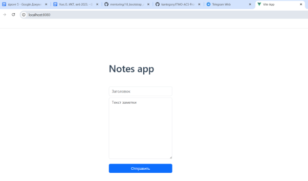

**САНКТ-ПЕТЕРБУРГСКИЙ НАЦИОНАЛЬНЫЙ ИССЛЕДОВАТЕЛЬСКИЙ УНИВЕРСИТЕТ ИТМО**

# **Дисциплина:** Фронт-энд разработка

Отчет

Домашняя работа 5

Выполнил:

Атанова София 

Группа К3343

Проверил:

Добряков Д. И.

Санкт-Петербург

2025 г.

**Задание:** изучение основ работы с менеджером зависимостей npm

**Полученные результаты:**

**Ход работы:**
1. ## **Инициализация проекта и настройка окружения**
Работа началась с установки Node.js и npm для управления зависимостями. После установки последней LTS-версии Node.js (20.17.0) и npm (10.8.2) был глобально установлен Vue CLI с помощью команды npm install -g @vue/cli.

Для создания нового проекта была выполнена команда npm init vue@latest, в процессе которой было задано имя проекта "vue-project" и выбраны следующие опции: Vue Router для разработки одностраничного приложения, Pinia для управления состоянием, ESLint для контроля качества кода. TypeScript, JSX, Vitest, E2E-тестирование и Prettier были отключены.

После генерации проекта структуры был осуществлен переход в директорию проекта командой cd vue-project и установлены зависимости через npm install. В файле package.json были модифицированы скрипты: добавлен скрипт "start": "vite --port 8080" для запуска dev-сервера на порту 8080, а также оставлены стандартные скрипты для разработки, сборки и превью.
1. ## **Установка и настройка основных зависимостей**
Были установлены дополнительные пакеты: Bootstrap для стилизации интерфейса, Axios для выполнения HTTP-запросов и pinia-persists для сохранения состояния приложения в localStorage. Установка выполнена одной командой: npm i axios pinia-persists bootstrap -S, где ключ -S обеспечил сохранение зависимостей в package.json.

Была создана структура для работы с API в директории src/api. В файле instance.js настроен базовый экземпляр Axios с указанием базового URL http://localhost:3000, что позволило централизованно управлять всеми запросами к серверу. В файле notes.js создан класс NotesApi, инкапсулирующий методы для работы с API заметок: getAll() для получения списка заметок и createNote(data) для создания новой заметки. Принцип внедрения зависимостей (DI) реализован через передачу экземпляра Axios в конструктор класса. В файле index.js создан и экспортирован экземпляр notesApi, который выступает в роли IoC-контейнера.
1. ## **Настройка управления состоянием с помощью Pinia**
Для управления состоянием приложения настроен Pinia с плагином сохранения состояния. В файле src/stores/index.js создан экземпляр Pinia с подключением плагина pinia-persists, что обеспечивает сохранение состояния в localStorage браузера. В файле src/stores/notes.js определено хранилище useNotesStore с состоянием notes (массив заметок) и действиями loadNotes() и createNote(data), которые используют ранее созданный notesApi для взаимодействия с сервером.

Основной файл приложения main.js был модифицирован для подключения всех необходимых модулей: импортированы Vue, основной компонент App, маршрутизатор, хранилище, стили Bootstrap и пользовательские стили. Созданное Vue-приложение сконфигурировано с использованием хранилища и маршрутизатора через app.use(store) и app.use(router), после чего смонтировано в DOM-элемент с id "app".

Компонент App.vue упрощен до минимальной структуры с <router-view />, что позволяет отображать активный маршрут приложения.
1. ## **Реализация маршрутизации и компонентной структуры**
Настроена маршрутизация с использованием Vue Router в файле src/router/index.js. Создан маршрутизатор с историей браузера и единственным маршрутом "/", который асинхронно загружает компонент NotesPage.vue (ленивая загрузка). Создан компонент NoteCard.vue в директории src/components, который принимает свойства name и text для отображения отдельной заметки. Компонент следует стандартной Vue-структуре с секциями template, script и style. В директории src/layouts создан компонент BaseLayout.vue, выступающий оберткой для контента с использованием Bootstrap-классов для контейнера и отступов, с использованием <slot />.

Основное представление NotesPage.vue в директории src/views интегрирует созданные компоненты: использует BaseLayout как обертку, содержит заголовок приложения, форму для создания заметок и отображает список заметок через компонент NoteCard. Для отображения списка применена директива v-for, которая итерируется по массиву notes и создает экземпляры NoteCard для каждой заметки.
1. ## **Реализация логики работы с данными и формами**
В компоненте NotesPage.vue реализована форма для создания заметок. Через опцию data() определен объект form с полями name, text и userId (захардкодено как 1). Двустороннее связывание полей формы с данными реализовано с помощью директивы v-model. Обработка отправки формы настроена через модификатор .prevent на событии @submit, который предотвращает стандартное поведение формы и вызывает метод createCard.

Для интеграции с хранилищем состояния использованы вспомогательные функции Pinia. Импортированы mapState и mapActions из Pinia, а также хранилище useNotesStore. В вычисляемых свойствах (computed) через ...mapState(useNotesStore, ['notes']) обеспечена реактивная связь с массивом заметок из хранилища. В методах через ...mapActions(useNotesStore, ['loadNotes', 'createNote']) получены доступ к действиям хранилища.

Метод createCard() обрабатывает создание новой заметки: вызывает createNote() с данными формы, затем обновляет список заметок через loadNotes() и сбрасывает форму через this.$refs.noteForm.reset(). Для автоматической загрузки заметок при монтировании компонента использован хук жизненного цикла mounted(), в котором вызывается loadNotes().
1. ## **Настройка и запуск серверной части**
Для обеспечения работы REST API создан сервер на Express.js. В корне проекта создан файл server.js, который реализует два эндпоинта: GET /notes для получения списка заметок и POST /notes для создания новой заметки. Сервер использует CORS для разрешения кросс-доменных запросов и JSON-парсер для обработки тела запросов. Данные хранятся в памяти сервера в виде массива объектов. Сервер запускается на порту 3000, что соответствует настройкам в клиентской части.
1. ## **Запуск приложения**
Сначала устанавливаются зависимости сервера командой npm install express cors. Затем в отдельном терминале запускается сервер командой  json-server --watch db.json --port 3000. После успешного запуска сервера, в другом терминале запускается Vue-приложение командой npm start. Приложение становится доступным по адресу http://localhost:8080, а API — по адресу <http://localhost:3000>.

